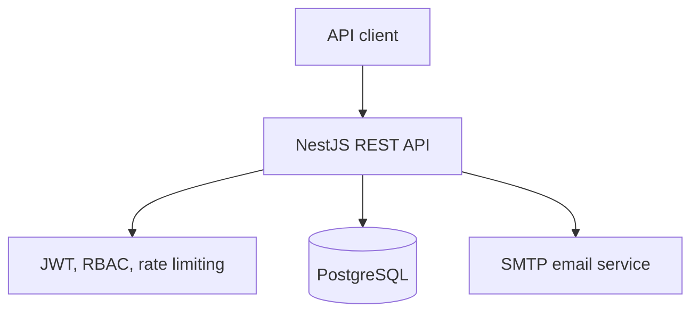
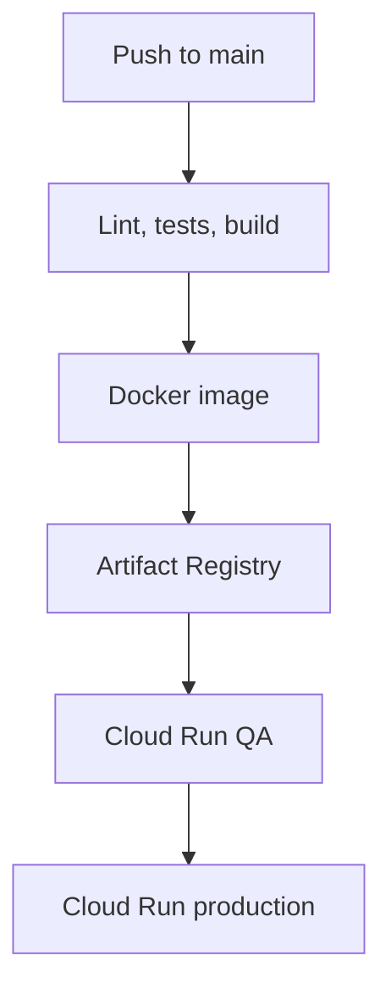

# Secure Text Sharing Platform

[](https://github.com/omilescuvlad/Secure-Text-Sharing-Platform/actions/workflows/ci.yml)
[](https://github.com/omilescuvlad/Secure-Text-Sharing-Platform/actions/workflows/docker.yml)

A backend API for creating, managing, and sharing text pastes.

The application is built with **NestJS**, **TypeScript**, **PostgreSQL**, and **TypeORM**, and includes JWT authentication, role-based authorization, email notifications, rate limiting, and Docker support.

## Features

- User registration
- Password hashing with bcrypt
- JWT authentication
- User and Admin roles
- Role-based access control
- Create, update, and delete text pastes
- Download pastes as `.txt` files
- Email notification when a paste is created
- Paste attached directly to notification emails
- Email unsubscribe functionality
- PostgreSQL database with TypeORM
- Request rate limiting
- Docker and Docker Compose support
- Unit and end-to-end testing with Jest
- Interactive Swagger/OpenAPI documentation
- GitHub Actions CI/CD with gated QA and production deployments

## Tech Stack

- **NestJS**
- **TypeScript**
- **Node.js**
- **PostgreSQL**
- **TypeORM**
- **JWT**
- **bcrypt**
- **Nodemailer**
- **NestJS Throttler**
- **Docker**
- **Docker Compose**
- **Jest**
- **Swagger / OpenAPI**
- **GitHub Actions**
- **Google Cloud Run, Cloud SQL, and Artifact Registry**

## Architecture



## Project Structure

```text
src/
├── auth/
│   ├── auth.controller.ts
│   ├── auth.guard.ts
│   ├── auth.module.ts
│   └── auth.service.ts
│
├── enums/
│   ├── role.enum.ts
│   ├── roles.decorator.ts
│   └── roles.guard.ts
│
├── mail/
│   ├── mail.module.ts
│   └── mail.service.ts
│
├── paste/
│   ├── dto/
│   ├── paste.controller.ts
│   ├── paste.entity.ts
│   ├── paste.module.ts
│   └── paste.service.ts
│
├── user/
│   ├── dto/
│   ├── user.controller.ts
│   ├── user.entity.ts
│   ├── user.module.ts
│   └── user.service.ts
│
├── app.module.ts
└── main.ts
```

## Getting Started

### Prerequisites

To run the project using Docker, you need:

- Git
- Docker
- Docker Compose

For local development without Docker:

- Node.js
- npm
- PostgreSQL

## Installation

Clone the repository:

```bash
git clone https://github.com/omilescuvlad/Secure-Text-Sharing-Platform.git
cd Secure-Text-Sharing-Platform
```

## Environment Variables

Create a `.env` file in the root directory:

```env
JWT_SECRET_KEY=your-secret-key

MAIL_USER=your-email@gmail.com
MAIL_PASS=your-email-password

APP_URL=http://localhost:3000
```

The Docker configuration uses Gmail SMTP with the following values:

```env
MAIL_HOST=smtp.gmail.com
MAIL_PORT=587
```

The default PostgreSQL configuration used by Docker is:

```env
DATABASE_HOST=db
DATABASE_PORT=5432
DATABASE_USER=postgres
DATABASE_PASS=admin
DATABASE_NAME=pastebin
```

## Running with Docker

Build and start the API and PostgreSQL database:

```bash
docker compose up --build
```

The API will be available at:

```text
http://localhost:3000
```

Interactive Swagger documentation will be available at:

```text
http://localhost:3000/api
```

PostgreSQL will be available on:

```text
localhost:5432
```

To stop the containers:

```bash
docker compose down
```

To also remove the database volume:

```bash
docker compose down -v
```

## Running Locally

Install dependencies:

```bash
npm install
```

Make sure PostgreSQL is running and configure the database environment variables:

```env
DATABASE_HOST=localhost
DATABASE_PORT=5432
DATABASE_USER=postgres
DATABASE_PASS=admin
DATABASE_NAME=pastebin
```

Start the application in development mode:

```bash
npm run start:dev
```

Production build:

```bash
npm run build
npm run start:prod
```

## Authentication

Authentication is handled using **JSON Web Tokens (JWT)**.

After logging in, the API returns an access token:

```json
{
  "access_token": "your-jwt-token"
}
```

Use the token for protected endpoints:

```http
Authorization: Bearer YOUR_TOKEN
```

JWT tokens currently expire after **60 seconds**.

## User Roles

The application supports two roles:

```text
user
admin
```

Roles are included inside the JWT payload and checked using NestJS guards.

## API Endpoints

### Authentication

| Method | Endpoint        | Description                          | Access        |
| ------ | --------------- | ------------------------------------ | ------------- |
| POST   | `/auth/login`   | Authenticate a user                  | Public        |
| GET    | `/auth/profile` | Get information from the current JWT | Authenticated |

### Users

| Method | Endpoint                    | Description                 | Access       |
| ------ | --------------------------- | --------------------------- | ------------ |
| POST   | `/users`                    | Register a new user         | Public       |
| GET    | `/users`                    | Get all users               | User / Admin |
| PUT    | `/users/:id`                | Update a user               | Admin        |
| DELETE | `/users/:id`                | Delete a user               | Admin        |
| GET    | `/users/unsubscribe/:token` | Disable email notifications | Public       |

### Pastes

| Method | Endpoint               | Description              | Access       |
| ------ | ---------------------- | ------------------------ | ------------ |
| POST   | `/pastes`              | Create a new paste       | Public       |
| GET    | `/pastes`              | Get all pastes           | Admin        |
| PUT    | `/pastes/:id`          | Update a paste           | User / Admin |
| DELETE | `/pastes/:id`          | Delete a paste           | User / Admin |
| GET    | `/pastes/:id/download` | Download paste as `.txt` | Public       |

## API Examples

### Register a User

```http
POST /users
Content-Type: application/json
```

```json
{
  "fullName": "John Doe",
  "username": "john",
  "password": "password123",
  "email": "john@example.com"
}
```

Passwords are hashed using **bcrypt** before being stored in the database.

### Login

```http
POST /auth/login
Content-Type: application/json
```

```json
{
  "username": "john",
  "password": "password123"
}
```

Example response:

```json
{
  "access_token": "eyJhbGciOiJIUzI1NiIs..."
}
```

### Get JWT Profile

```http
GET /auth/profile
Authorization: Bearer YOUR_TOKEN
```

Example response:

```json
{
  "sub": 1,
  "username": "john",
  "roles": ["user"]
}
```

### Create a Paste

```http
POST /pastes
Content-Type: application/json
```

```json
{
  "content": "This is my text paste.",
  "userId": 1
}
```

When a paste is created, the associated user can receive an email containing:

- The paste content
- A download link
- The paste as a `.txt` attachment
- An unsubscribe link

### Get All Pastes

Administrator access is required.

```http
GET /pastes
Authorization: Bearer ADMIN_TOKEN
```

### Update a Paste

```http
PUT /pastes/1
Authorization: Bearer YOUR_TOKEN
Content-Type: application/json
```

```json
{
  "content": "Updated paste content."
}
```

### Delete a Paste

```http
DELETE /pastes/1
Authorization: Bearer YOUR_TOKEN
```

### Download a Paste

```http
GET /pastes/1/download
```

The API returns the content as:

```text
paste-1.txt
```

## Email Notifications

When a paste is successfully created, the API sends an email to the associated user if email notifications are enabled.

The email contains the paste content and includes the paste as a `.txt` attachment.

Users can disable future email notifications using the unsubscribe URL contained in the email:

```text
/users/unsubscribe/:token
```

Each user receives a unique unsubscribe token when the account is created.

## Rate Limiting

The application uses `@nestjs/throttler` to limit API requests.

The current global limit is:

```text
10 requests per 60 seconds
```

Requests exceeding this limit will be rejected by the throttler guard.

## Health Check

The API exposes a database-aware readiness endpoint:

```http
GET /health
```

A healthy application returns:

```json
{
  "status": "ok",
  "database": "up"
}
```

If PostgreSQL cannot be reached, the endpoint returns HTTP `503 Service Unavailable`.

## Database

The application uses **PostgreSQL** with **TypeORM**.

The main entities are:

### User

Stores user information, authentication data, roles, email preferences, and the relationship with pastes.

### Paste

Stores the text content and its relationship with the user who created it.

TypeORM automatically synchronizes the database schema when the application starts.

> `synchronize: true` is convenient during development but should normally be replaced by migrations in a production environment.

## Available Scripts

Start the application:

```bash
npm run start
```

Development mode with file watching:

```bash
npm run start:dev
```

Debug mode:

```bash
npm run start:debug
```

Build the project:

```bash
npm run build
```

Run production build:

```bash
npm run start:prod
```

Run linting:

```bash
npm run lint
```

Format the source code:

```bash
npm run format
```

Run unit tests:

```bash
npm test
```

Run unit tests with coverage and enforce the global coverage threshold:

```bash
npm run test:cov
```

Run PostgreSQL-backed end-to-end tests:

```bash
npm run test:e2e
```

Run tests in watch mode:

```bash
npm run test:watch
```

## CI/CD

Pull requests and pushes to `main` run ESLint, unit tests with coverage, PostgreSQL-backed end-to-end tests, and a production build. Jest measures the service and guard layer, enforcing minimum coverage thresholds of **85% for statements, functions, and lines** and **70% for branches**.

After CI succeeds on a push to `main`, the deployment workflow builds the exact validated commit, pushes its Docker image to Google Artifact Registry, deploys QA, and then deploys production. Manual QA or production deployments run the same validation gate first.



## Docker Services

Docker Compose starts two services:

### API

```text
pastebin-api
```

Available on port:

```text
3000
```

### PostgreSQL

```text
pastebin-db
```

Uses the `postgres:16-alpine` Docker image and stores database data in a persistent Docker volume.

## Security Features

The project includes several security-related mechanisms:

- Password hashing using bcrypt
- JWT-based authentication
- Role-based authorization
- Protected API routes using guards
- Global request rate limiting
- Environment variables for application secrets
- Unique unsubscribe tokens for email preferences

## Author

**Vlad Omilescu**

GitHub: [@omilescuvlad](https://github.com/omilescuvlad)

---

Built with NestJS, TypeScript, PostgreSQL, and Docker.
